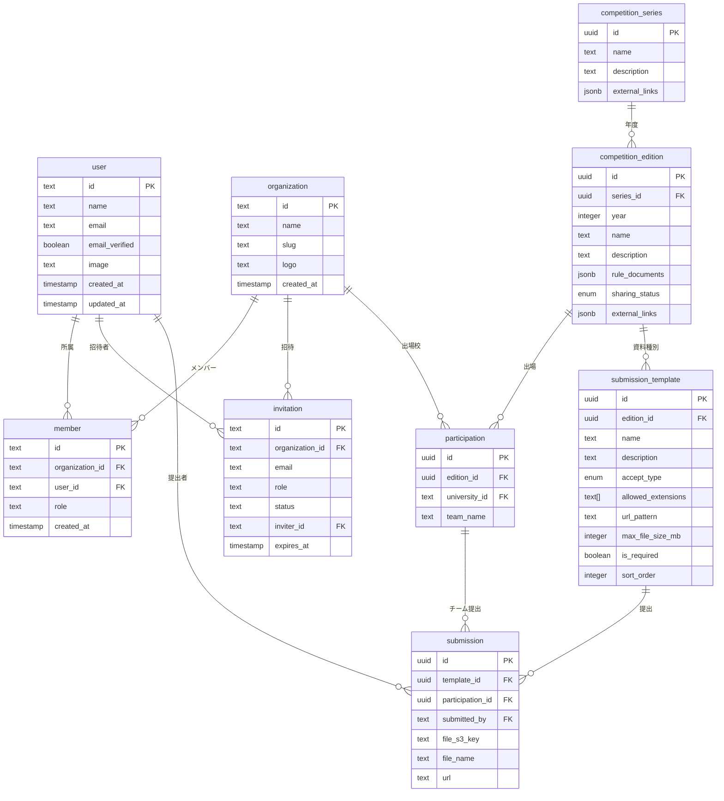

# ロボコン情報共有サービス 仕様書

**バージョン:** 0.1.0（ドラフト）
**最終更新:** 2026-03-14

---

## 1. サービス概要

ロボコンに出場した学校同士の情報共有を目的としたWebサービス。過去の大会情報のアーカイブと、出場校間での審査資料の相互共有を主要機能とする。

初期対象は NHK学生ロボコンおよびその類似大会（ABUロボコン等）。

---

## 2. 技術スタック

| レイヤー | 技術 | 備考 |
|----------|------|------|
| フロントエンド | Next.js (App Router) | Server Actions不使用、API経由でバックエンドと通信 |
| バックエンド | Hono | hono/zod-openapi によるOpenAPI自動生成 |
| DB | PostgreSQL | |
| ORM | Drizzle ORM | Better Auth の Drizzle アダプター利用 |
| 認証 | Better Auth | Organization プラグインで大学・招待・ロール管理 |
| ファイルストレージ | S3互換 (R2, MinIO, AWS S3等) | 署名付きURLでのアップロード/ダウンロード |
| デプロイ | 未定 | ベンダーロックイン回避を優先 |

### 2.1 アーキテクチャ方針

```
┌──────────────┐     REST API (JSON)     ┌──────────────┐
│  Next.js     │ ◄─────────────────────► │  Hono API    │
│  (Frontend)  │                         │  (Backend)   │
└──────────────┘                         └──────┬───────┘
                                                │
                              ┌─────────────────┼─────────────────┐
                              ▼                 ▼                 ▼
                        ┌──────────┐     ┌──────────┐     ┌──────────┐
                        │PostgreSQL│     │Better Auth│     │S3互換     │
                        │          │     │(認証/認可) │     │ストレージ │
                        └──────────┘     └──────────┘     └──────────┘
```

- フロントエンドは Next.js の App Router を使用するが、Server Actions は使用しない
- すべてのデータ操作は Hono バックエンドの REST API を経由する
- Better Auth は Hono に統合し、認証エンドポイントを `/api/auth/*` にマウントする
- ファイルアップロードはバックエンドが署名付きURLを発行し、フロントエンドからS3に直接アップロードする

---

## 3. ユーザーロールと権限

### 3.1 ロール一覧

| ロール | 説明 |
|--------|------|
| **システム管理者 (admin)** | サービス全体を管理する運営スタッフ（複数人）。細かい権限分離は初期段階では行わない |
| **代表者 (owner)** | 大学ごとの管理者。Better Auth Organization の `owner` ロールに対応。複数人設置可能 |
| **メンバー (member)** | 大学に所属する一般ユーザー。Better Auth Organization の `member` ロールに対応 |

### 3.2 権限マトリクス

| 操作 | admin | owner | member | 未認証 |
|------|-------|-------|--------|--------|
| 大会シリーズ / 大会回の作成・編集 | ✅ | ❌ | ❌ | ❌ |
| ルール資料の登録・編集 | ✅ | ❌ | ❌ | ❌ |
| 大会概要・ルールの閲覧 | ✅ | ✅ | ✅ | ✅（公開） |
| 出場登録 (Participation) の管理 | ✅ | ❌ | ❌ | ❌ |
| 資料種別テンプレートの管理 | ✅ | ❌ | ❌ | ❌ |
| 自校の資料アップロード・差し替え | ✅ | ✅ | ✅ | ❌ |
| 自校の資料削除 | ✅ | ✅ | ❌ | ❌ |
| 他校の資料閲覧（条件付き） | ✅ | ✅ | ✅ | ❌ |
| 大学メンバーの招待 | ✅ | ✅ | ❌ | ❌ |
| 代表者権限の移譲・付与 | ✅ | ✅ | ❌ | ❌ |
| 大学の作成 | ✅ | ❌ | ❌ | ❌ |

---

## 4. データモデル

### 4.1 エンティティ一覧

Better Auth が管理するテーブル（user, session, account, organization, member, invitation）と、
アプリケーション固有のテーブルに分かれる。

#### Better Auth 管理テーブル（Organization プラグイン）

| テーブル名 | 本サービスでの意味 | 備考 |
|------------|-------------------|------|
| user | ユーザーアカウント | 永年有効。メール、表示名等 |
| session | ログインセッション | Better Auth が自動管理 |
| account | 認証プロバイダー連携 | Google OAuth 等 |
| organization | **大学** | name, slug, logo 等。Better Auth の Organization をリネームして利用 |
| member | **ユーザーと大学の所属関係** | role: "owner" (代表者) / "member" (一般) |
| invitation | **大学への招待** | メール招待、有効期限付き |

#### アプリケーション固有テーブル

**competition_series（大会シリーズ）**

| カラム | 型 | 説明 |
|--------|-----|------|
| id | uuid (PK) | |
| name | text | 例: "NHK学生ロボコン" |
| description | text | 大会シリーズの説明 |
| external_links | jsonb | 関連リンク集 `[{label, url}]` |
| created_at | timestamp | |
| updated_at | timestamp | |

**competition_edition（大会回）**

| カラム | 型 | 説明 |
|--------|-----|------|
| id | uuid (PK) | |
| series_id | uuid (FK → competition_series) | |
| year | integer | 開催年 |
| name | text | 例: "NHK学生ロボコン2024" |
| description | text | その年のテーマ等 |
| rule_documents | jsonb | 運営が登録するルール資料 `[{label, s3_key, mime_type}]` |
| sharing_status | enum | `draft` / `accepting` / `sharing` / `closed` |
| external_links | jsonb | `[{label, url}]` |
| created_at | timestamp | |
| updated_at | timestamp | |

`sharing_status` の意味:

- `draft`: 準備中。出場校には非表示
- `accepting`: 資料受付中。アップロード可能だが、他校の資料は閲覧不可
- `sharing`: 相互共有中。アップロード済みの大学は他校の資料を閲覧可能
- `closed`: 締切後。新規アップロード不可、閲覧権限は維持

> **設計判断:** 「原則相互閲覧可能」の方針に基づき、通常運用では `accepting` → `sharing` の切り替えを即座に行うか、最初から `sharing` にして運用する。ただし、公平性の観点から問題が生じた場合に備え、ステータスの仕組みは残しておく。

**participation（出場登録）**

| カラム | 型 | 説明 |
|--------|-----|------|
| id | uuid (PK) | |
| edition_id | uuid (FK → competition_edition) | |
| university_id | text (FK → organization.id) | Better Auth の organization.id |
| team_name | text (nullable) | チーム名（複数チームの場合） |
| created_at | timestamp | |

同一大学が同一大会回に複数レコードを持ちうる（複数チーム出場時）。

**submission_template（資料種別テンプレート）**

| カラム | 型 | 説明 |
|--------|-----|------|
| id | uuid (PK) | |
| edition_id | uuid (FK → competition_edition) | |
| name | text | 例: "ビデオ審査", "コンセプトシート" |
| description | text | 説明文 |
| accept_type | enum | `file` / `url` |
| allowed_extensions | text[] | `file` の場合: `["pdf"]`, `["pdf","pptx"]` 等 |
| url_pattern | text (nullable) | `url` の場合のバリデーション（例: `youtube.com` ドメイン制限） |
| max_file_size_mb | integer | `file` の場合の上限（MB） |
| is_required | boolean | 必須かどうか |
| sort_order | integer | 表示順 |
| created_at | timestamp | |

**submission（提出資料）**

| カラム | 型 | 説明 |
|--------|-----|------|
| id | uuid (PK) | |
| template_id | uuid (FK → submission_template) | |
| participation_id | uuid (FK → participation) | どのチームの提出か |
| submitted_by | text (FK → user.id) | アップロードしたユーザー |
| file_s3_key | text (nullable) | `file` の場合の S3 キー |
| file_name | text (nullable) | 元のファイル名 |
| file_size_bytes | bigint (nullable) | |
| file_mime_type | text (nullable) | |
| url | text (nullable) | `url` の場合のURL |
| created_at | timestamp | |
| updated_at | timestamp | |

> **設計判断:** 差し替え（上書き）は許可する。履歴管理は初期段階では行わず、最新版のみ保持する。将来的にバージョニングが必要になった場合は、submission_history テーブルを追加する。

### 4.2 ER図



---

## 5. 閲覧権限ロジック

### 5.1 他校資料の閲覧条件

大会回 E において、ユーザー U が他校の資料を閲覧できる条件:

```
1. E の sharing_status が "sharing" または "closed" である
2. U がいずれかの大学 X に所属している (member テーブル)
3. 大学 X が大会回 E に出場登録している (participation テーブル)
4. 大学 X の出場登録に紐づく submission が1つ以上存在する
```

条件を満たした場合、大会回 E の**全資料種別**の他校資料を閲覧可能（大会回単位の一括判定）。

### 5.2 同一大学の複数チーム

大学 X のチーム1とチーム2は互いの資料を無条件で閲覧可能。
閲覧権限の判定は「大学」単位であり、チーム単位ではない。

### 5.3 admin の特例

admin ロールを持つユーザーは全資料を閲覧可能。

### 5.4 擬似コード

```typescript
async function canViewOtherSubmissions(
  userId: string,
  editionId: string
): Promise<boolean> {
  // admin は常に閲覧可
  if (await isAdmin(userId)) return true;

  // 大会回のステータス確認
  const edition = await getEdition(editionId);
  if (!["sharing", "closed"].includes(edition.sharingStatus)) return false;

  // ユーザーの所属大学一覧を取得
  const universityIds = await getUserUniversityIds(userId);

  // いずれかの所属大学がこの大会回に提出済みか確認
  for (const univId of universityIds) {
    const hasSubmission = await hasAnySubmission(univId, editionId);
    if (hasSubmission) return true;
  }

  return false;
}
```

---

## 6. 認証・招待フロー

### 6.1 Better Auth 構成

```typescript
// auth.ts
import { betterAuth } from "better-auth";
import { organization } from "better-auth/plugins";
import { drizzleAdapter } from "better-auth/adapters/drizzle";

export const auth = betterAuth({
  database: drizzleAdapter(db, { provider: "pg" }),
  emailAndPassword: { enabled: true },
  socialProviders: {
    google: {
      clientId: process.env.GOOGLE_CLIENT_ID!,
      clientSecret: process.env.GOOGLE_CLIENT_SECRET!,
    },
  },
  plugins: [
    organization({
      async sendInvitationEmail(data) {
        // メール送信ロジック
        const inviteLink = `${BASE_URL}/invite/${data.id}`;
        await sendEmail({
          to: data.email,
          subject: `${data.organization.name} への招待`,
          body: `${data.inviter.user.name} さんから招待されました: ${inviteLink}`,
        });
      },
    }),
  ],
});
```

### 6.2 招待フロー

```
[admin]
  │ 大学 (Organization) を作成
  │ 初期代表者のメールアドレスを指定して招待
  ▼
[代表者 (owner)]
  │ 招待メールのリンクからアカウント作成 or ログイン
  │ 招待を承認して大学に参加
  │ 他のメンバーをメールで招待（role: member）
  │ 他のメンバーに owner 権限を付与可能
  ▼
[メンバー (member)]
  │ 招待メールのリンクからアカウント作成 or ログイン
  │ 招待を承認して大学に参加
  │ 自校の資料アップロード等が可能に
```

### 6.3 複数大学所属

- ユーザーは複数の Organization (大学) に所属可能
- Better Auth の `activeOrganization` 機能でビューを切り替える
- フロントエンドにはOrganization切り替えUIを設置
- API リクエスト時は `X-Organization-Id` ヘッダー等で現在のコンテキストを指定

---

## 7. 主要画面一覧

### 7.1 公開画面（未認証でもアクセス可）

| 画面 | パス | 説明 |
|------|------|------|
| トップページ | `/` | サービス紹介 |
| 大会シリーズ一覧 | `/competitions` | |
| 大会回詳細 | `/competitions/:seriesSlug/:year` | ルール、リンク集 |
| ログイン | `/auth/login` | |
| アカウント作成 | `/auth/register` | |
| 招待承認 | `/invite/:invitationId` | |

### 7.2 認証済み画面

| 画面 | パス | 説明 |
|------|------|------|
| ダッシュボード | `/dashboard` | 所属大学の大会一覧、最近の更新 |
| 大学切り替え | (モーダル/ドロップダウン) | 所属大学のコンテキスト切り替え |
| 大会回 - 資料提出 | `/editions/:id/submit` | 自校の資料アップロード |
| 大会回 - 資料一覧 | `/editions/:id/submissions` | 全出場校の資料一覧（閲覧条件付き） |
| 大学設定 | `/university/settings` | メンバー管理、招待 |
| アカウント設定 | `/account/settings` | プロフィール、パスワード変更 |

### 7.3 管理画面

| 画面 | パス | 説明 |
|------|------|------|
| 管理ダッシュボード | `/admin` | |
| 大会シリーズ管理 | `/admin/series` | CRUD |
| 大会回管理 | `/admin/editions` | CRUD、sharing_status の切り替え |
| 出場登録管理 | `/admin/editions/:id/participations` | 出場校・チーム登録 |
| 資料種別テンプレート管理 | `/admin/editions/:id/templates` | テンプレート CRUD、前回からのコピー |
| 大学管理 | `/admin/universities` | 大学の作成、代表者招待 |

---

## 8. API エンドポイント設計

### 8.1 認証（Better Auth が提供）

```
POST/GET /api/auth/*    -- Better Auth ハンドラー
```

### 8.2 公開 API

```
GET /api/series                         -- 大会シリーズ一覧
GET /api/series/:id                     -- 大会シリーズ詳細
GET /api/editions                       -- 大会回一覧 (?series_id=...)
GET /api/editions/:id                   -- 大会回詳細（ルール資料含む）
```

### 8.3 認証済み API

```
# 資料提出
GET    /api/editions/:id/templates      -- 資料種別テンプレート一覧
GET    /api/editions/:id/my-submissions -- 自校（現在のコンテキスト大学）の提出状況
POST   /api/submissions                 -- 資料提出（メタデータ登録）
PUT    /api/submissions/:id             -- 資料差し替え
DELETE /api/submissions/:id             -- 資料削除（owner のみ）

# ファイルアップロード
POST   /api/upload/presign              -- S3 署名付きアップロードURL取得

# 資料閲覧
GET    /api/editions/:id/submissions    -- 全出場校の資料一覧（権限チェック付き）

# 大学管理（owner のみ）
GET    /api/university/members          -- メンバー一覧
POST   /api/university/invite           -- メンバー招待（Better Auth 経由）
PUT    /api/university/members/:id/role -- ロール変更
DELETE /api/university/members/:id      -- メンバー削除
```

### 8.4 管理 API

```
# 大会シリーズ
POST   /api/admin/series
PUT    /api/admin/series/:id
DELETE /api/admin/series/:id

# 大会回
POST   /api/admin/editions
PUT    /api/admin/editions/:id
DELETE /api/admin/editions/:id
PUT    /api/admin/editions/:id/status   -- sharing_status 変更

# ルール資料（大会回に紐づく）
POST   /api/admin/editions/:id/rules/presign  -- ルール資料アップロードURL
PUT    /api/admin/editions/:id/rules          -- ルール資料メタデータ更新

# 出場登録
POST   /api/admin/editions/:id/participations
PUT    /api/admin/participations/:id
DELETE /api/admin/participations/:id

# 資料種別テンプレート
POST   /api/admin/editions/:id/templates
PUT    /api/admin/templates/:id
DELETE /api/admin/templates/:id
POST   /api/admin/editions/:id/templates/copy-from/:sourceEditionId  -- 前回からコピー

# 大学管理
POST   /api/admin/universities          -- Organization 作成
GET    /api/admin/universities          -- 一覧
```

---

## 9. ファイルストレージ設計

### 9.1 S3 キー命名規則

```
rules/{edition_id}/{filename}                       -- ルール資料
submissions/{edition_id}/{participation_id}/{template_id}/{filename}  -- 提出資料
```

### 9.2 アップロードフロー

```
1. フロントエンド → バックエンド: POST /api/upload/presign
   - Body: { participation_id, template_id, filename, content_type }
   - バックエンドがバリデーション（拡張子、サイズ上限、accept_type チェック）

2. バックエンド → フロントエンド: { presigned_url, s3_key }

3. フロントエンド → S3: PUT (署名付きURL で直接アップロード)

4. フロントエンド → バックエンド: POST /api/submissions
   - Body: { template_id, participation_id, s3_key, file_name, file_size_bytes, mime_type }
   - メタデータを DB に登録
```

### 9.3 ダウンロードフロー

```
1. フロントエンド → バックエンド: GET /api/submissions/:id/download
   - 権限チェック（閲覧条件 + 所属確認）
   - 署名付きダウンロードURLを返却（有効期限: 5分程度）

2. フロントエンド → S3: GET (署名付きURL で直接ダウンロード)
```

### 9.4 URL 提出の場合

YouTube限定公開URLの場合は S3 を経由せず、submission テーブルの `url` カラムに直接保存する。
バリデーションとして、`url_pattern` に基づきドメインが `youtube.com` または `youtu.be` であることを確認する。

---

## 10. 未決事項・将来の拡張

| 項目 | 状態 | 備考 |
|------|------|------|
| メール送信サービス | 未定 | Resend, SendGrid, SES 等の選定 |
| ファイルサイズ上限 | 要検討 | PDF: 50MB? PPTX: 100MB? 程度を想定 |
| データ保持期間 | 要検討 | 永久保存 or N年で削除 |
| コメント・フィードバック機能 | 将来 | 初期スコープ外 |
| 資料のバージョン履歴 | 将来 | 初期は最新版のみ保持 |
| 通知機能 | 将来 | 資料アップロード通知、招待通知 |
| i18n（多言語対応） | 将来 | ABUロボコン等の国際大会を見据えて |
| admin の詳細権限分離 | 将来 | 初期は全 admin が全操作可能 |
| デプロイ先の選定 | 要検討 | Docker Compose でのセルフホスト or マネージドサービス |
